# Awesome Mosque Management 🕌

  
  
  
  
  
  

---

## 📌 Overview & SEO Summary

**Awesome Mosque Management** is a curated, production-ready index of **Mosque (Masjid) SaaS platforms**, **open-source community ERPs**, **digital prayer display systems**, **Baitul Maal & Zakat financial accounting platforms**, and **Islamic civic infrastructure tools**. 

Whether you are a mosque administrator, imam, finance manager, or Muslim tech builder, this directory helps you discover free, self-hostable tools and commercial solutions to streamline daily operations, prayer schedules, member registries, donation kiosks, and congregant communication.

`#mosque-management` `#masjid-software` `#islamic-tech` `#prayer-times` `#digital-signage` `#zakat-management` `#open-source-masjid` `#baitul-maal` `#awesome-list`

---

## 📑 Table of Contents

- [🏢 SaaS / Hosted Platforms](#-saas--hosted-platforms)
- [⚡️ Open-Source GitHub Projects](#%EF%B8%8F-open-source-github-projects)
- [💡 Frameworks & Architecture Guidelines](#-frameworks--architecture-guidelines)
- [🤝 How to Contribute](#-how-to-contribute)
- [💖 Support & Contributions](#-support--contributions)
- [📈 Star History](#-star-history)
- [⚖️ Disclaimer](#%EF%B8%8F-disclaimer)

---

## 🏢 SaaS / Hosted Platforms

> 📊 **Estimated Market Size & Industry Structure**: The global Mosque Management & Islamic Digital Tools software market is estimated at **$100M–$250M annually** (as part of the broader $1.1B+ faith-based management software sector). The market is **highly fragmented**, served by over 50+ specialized regional software providers and niche developers rather than a single dominant winner-take-all monopoly.

| Product / Platform | Description | Pricing (Starting Tier) | Free Tier Limit / Free Trial | Company Size / Scale (Sorted Descending) |
| :--- | :--- | :--- | :--- | :--- |
| **[IslamicFinder Mosque Tools](https://www.islamicfinder.org/)** | Global prayer times, Qibla direction, Quran app, and digital tools for masjids & congregants worldwide. | Free core ad-supported services; Premium/Plus ad-free plan from $1.99/mo ($19.99/yr) | Free forever for core prayer times, Qibla finder, and basic community features (ad-supported) | **10M+ App Downloads** & Millions of monthly active users (Est. $2M–$5M ARR / valuation scale) |
| **[MOHID](https://mohid.net/)** | Comprehensive US mosque management, online donation kiosks, Tap & Pay terminals, and member portal. | Basic Plan at $99/mo; Professional Plan at $199/mo; Custom modular plans from $99–$214/mo | 14-day free trial & custom demo environment upon request (no software feature locks during trial) | **500+ Islamic Centers** in North America (Est. $1M–$3M ARR) |
| **[Masjidbox](https://masjidbox.com/)** | Digital screens, branded mobile apps, announcements, event calendar, and online donation widgets for mosques. | Silver Plan at €29/mo (~$32/mo); Global All-in-One plan at €62/mo (~$68/mo) | Free forever plan for Donations, Widgets & Masjidbox One app (Screens limited to 1 manager/screen) | **2,500+ Mosques worldwide** across 40+ countries (Est. $500K–$1.5M ARR) |
| **[Masjidal / MyMasjid Hub](https://mymasjidal.com/)** | Al-Iqamah signage, prayer displays, mobile app integration, and community donation tools. | Basic Tier at $20/mo; Pro Tier up to $90/mo (billed annually) | Free Plan available for basic Al-Iqamah signage & website widgets; 15-day free trial on paid plans (no credit card required) | **1,000+ Masjids active** across North America & UK (Est. $300K–$800K ARR) |
| **[Masjid Solutions](https://masjidsolutions.net/)** | Modular mosque CRM, donation kiosks, IQRA school management system, and digital signage. | Modular plans starting at $50/mo for basic CRM; up to $150/mo for multi-kiosk & school modules | 30-day trial period provided with interactive custom demo environment upon request | **200+ Masjids & Islamic Schools** in North America (Est. $200K–$600K ARR) |
| **[eMasjid](https://emasjid.in/)** | Digital mosque management platform covering household directory, donation receipts, and prayer schedules. | Standard Tier starting at ₹499/mo (~$6/mo or €15/mo for EU); Premium at ₹999/mo (~$12/mo) | Free forever Basic Plan limited to 50 household member registrations; 14-day free trial on paid plans | **150+ Masjids** in South Asia & Europe (Est. $50K–$200K ARR) |
| **[MyMasjid (Asia)](https://mymasjid.asia/)** | Southeast Asian mosque administration suite for accounting, member database, and local event management. | Core management modules starting at RM 80/mo (~$18/mo) | 14-day free trial evaluation license available upon request | **100+ Masjids** across Malaysia & SE Asia (Est. $30K–$100K ARR) |
| **[SmartMasjid](https://smartmasjid.app/)** | Digital TV displays for prayer schedules, iqama timing sync, and mobile community app integration. | Starter Display Plan starting at $15/mo per screen | Free forever tier for single-screen basic prayer schedule display (watermarked/limited themes) | **100+ active mosque displays** (Est. $20K–$80K ARR) |

---

## ⚡️ Open-Source GitHub Projects

*Open-source mosque solutions empower committees with complete data sovereignty, zero licensing costs, and customization options. Sorted by GitHub star count in descending order.*

- **[choubari/Awesome-Muslims](https://github.com/choubari/Awesome-Muslims)**   
  Curated list of open-source resources, APIs, calculation libraries, and applications for Islamic software development.

- **[batoulapps/adhan-js](https://github.com/batoulapps/adhan-js)**   
  High-precision JavaScript/TypeScript library for calculating Islamic prayer times, powering digital displays & web apps worldwide.

- **[meypod/al-azan](https://github.com/meypod/al-azan)**   
  Privacy-focused, open-source prayer times calculation engine and Qibla direction application built with TypeScript.

- **[DBChoco/Muezzin](https://github.com/DBChoco/Muezzin)**   
  Open-source desktop application (Windows/macOS/Linux) providing Adhan automation, prayer schedules, and Quran access.

- **[choubari/Muslim-App](https://github.com/choubari/Muslim-App)**   
  Native Java Android application featuring prayer calculation engines, Adhan notifications, and community Qibla utilities.

- **[MosqueOS/Mosque-Prayer-Display-Screen](https://github.com/MosqueOS/Mosque-Prayer-Display-Screen)**   
  Open-source PWA & web display software for showing mosque prayer schedules, Iqama countdowns, and announcements on TV screens.

- **[digitaljamath/digitaljamath](https://github.com/digitaljamath/digitaljamath)**   
  Community-trust software for masjids built on Frappe + ERPNext (MIT). Covers household census, Baitul Maal (Zakat/Sadaqah), member portal, receipts, and Shariah compliance.

- **[dr-msr/e-masjid.my-drmsr](https://github.com/dr-msr/e-masjid.my-drmsr)**   
  Free, open-source mosque management system (MIT) designed for non-technical administrators to manage mosque administration and operations.

- **[novaka-dev/masjid-finance](https://github.com/novaka-dev/masjid-finance)**   
  Open mosque finance management system (Next.js) with role-based access control, income/expense tracking, charts, and public transparency features.

- **[mastomat/SIMMasjid](https://github.com/mastomat/SIMMasjid)**   
  Open CodeIgniter-based mosque information and financial system with prayer timing APIs, news, activities, and member management.

- **[yusuf-ravat/Smart-Masjid](https://github.com/yusuf-ravat/Smart-Masjid)**   
  Full-stack web application (React & Node.js) featuring prayer time automation, donation tracking, and event scheduling.

- **[EG-Mohamed/Mosque](https://github.com/EG-Mohamed/Mosque)**   
  Mosque web portal and admin panel (Laravel / Filament) with multilingual (Arabic/English RTL) support, prayer times, events, page builder, and media gallery.

- **[Mohd-ismail0/musallih](https://github.com/Mohd-ismail0/musallih)**   
  Open Islamic civic infrastructure platform with map-first discovery of masjids, prayer calendar integration, and staff workflows.

---

## 💡 Frameworks & Architecture Guidelines

When selecting software for your mosque or Islamic center:

1. **Full Community & Sacred Funds Platforms**: Use **Digital Jamath** (Frappe/ERPNext) or **E-Masjid.My** for full household census tracking, Zakat/Sadaqah auditing, and member portals.
2. **Website & Admin CMS**: Use **EG-Mohamed/Mosque** (Laravel + Filament) for public multilingual websites with RTL support and prayer time widgets.
3. **Financial Transparency**: Use **Masjid Finance** or **SIMMasjid** for clear income/expense dashboards accessible to auditors and congregants.
4. **Digital TV Displays**: Combine **MosqueOS** or **batoulapps/adhan-js** with low-cost Raspberry Pi or Android TV devices for automated Adhan & Iqama countdown screens.
5. **Hybrid Deployments**: Most mature masjids use open-source tools for core administration & finance transparency, alongside commercial SaaS solutions (such as Masjidbox or MOHID) for polished mobile apps and hardware donation kiosks.

---

## 🤝 How to Contribute

Contributions are welcome! Help us maintain the most accurate directory for the global Muslim developer and mosque community:

1. 🍴 **Fork** this repository.
2. 📝 Add or update entries in `README.md` following the standard table/list format.
3. 🔗 Ensure all links lead directly to official websites or GitHub repositories with factual descriptions.
4. 🚀 Submit a **Pull Request** with a brief summary of the added project.

---

## 💖 Support & Contributions

Thank you for exploring and supporting **Awesome Mosque Management**! If you find this repository helpful for your mosque, community center, or software project, please consider supporting the project:

- ⭐️ **Star this repository** to help others discover these tools.
- 🔀 **Fork and Contribute** by opening a Pull Request with new software or open-source projects.
- 📢 **Share with Imams, Mosque Committees, & Developers** in your community.
- ☕️ **Sponsor the Maintainer**: Support ongoing development and curation via the [Sponsor Dashboard](https://github.com/sponsors/ishandutta2007).

---

## 📈 Star History

---

## ⚖️ Disclaimer

- This directory is a **community-curated index** and does not constitute an official endorsement of any vendor or software.
- Mosque management involves sensitive donor information, financial records, and congregant data. Ensure appropriate GDPR/privacy compliance and financial auditing controls.
- Open-source tools eliminate licensing costs but require hosting and maintenance. Commercial platforms reduce administrative overhead with managed infrastructure. Select solutions based on your committee's technical capacity and budget.

---

  <b>Built for mosque committees, imams, administrators, and Muslim community technologists worldwide. 🤲</b>

